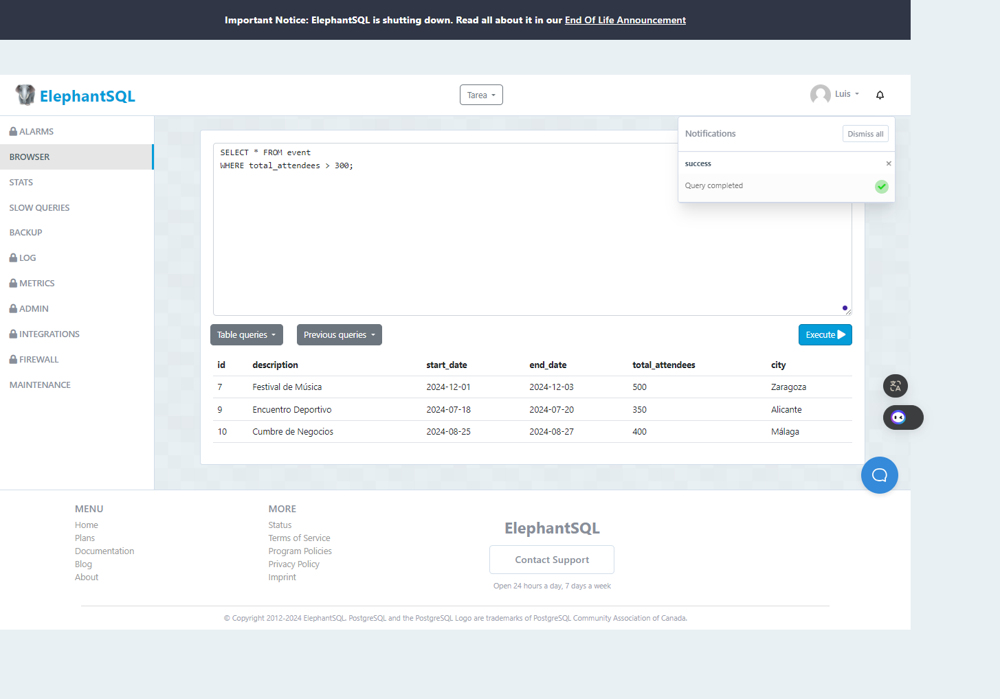
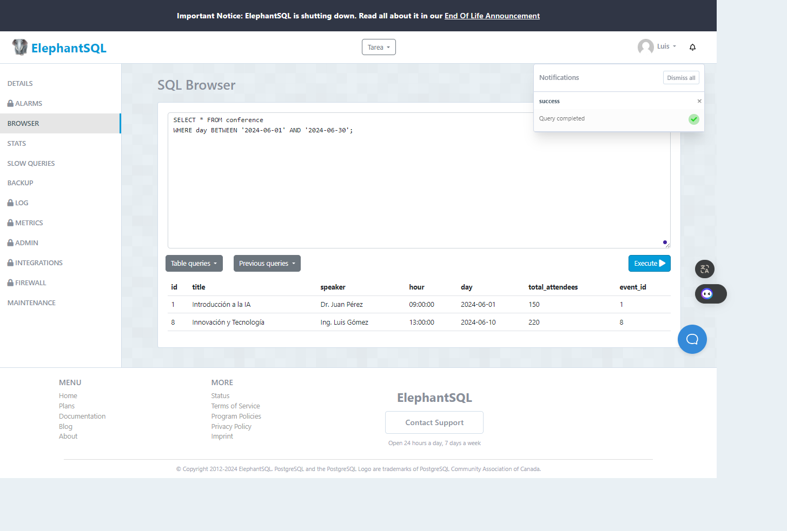
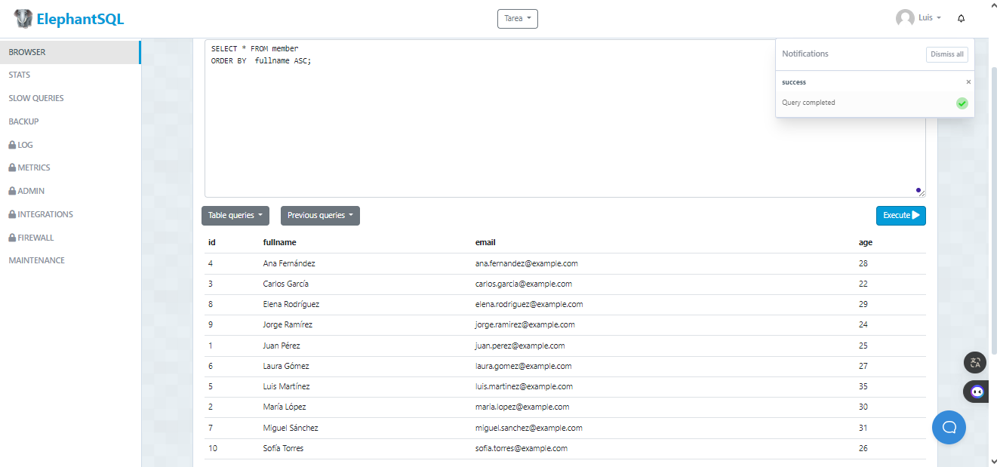
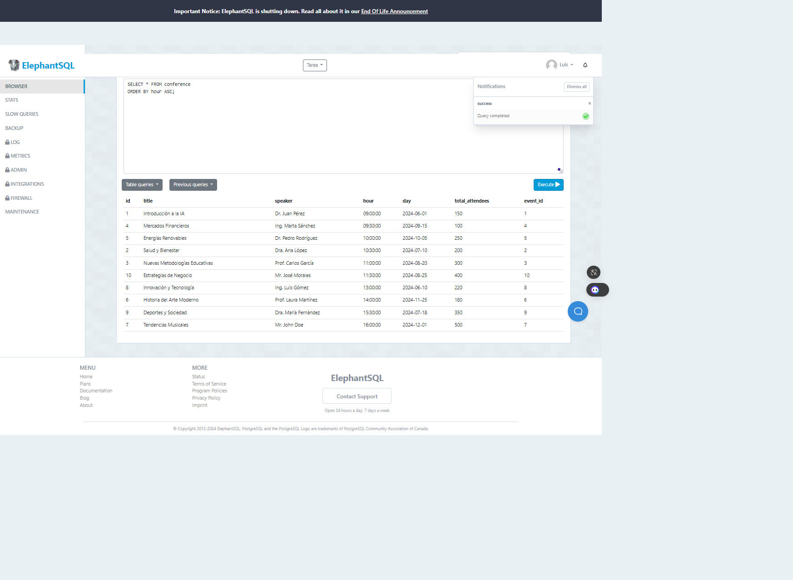

<<<<<<< HEAD
-- Tarea en Clase semana 8
-- La función COUNT

-- Creación de la tabla
CREATE TABLE client (
    id SERIAL,
    nui VARCHAR(10) NOT NULL,
    fullname VARCHAR(100) NOT NULL,
    phone VARCHAR(10),
    type_of_client VARCHAR(10) DEFAULT 'BASIC',
    city VARCHAR(10), 
    credit_limit DECIMAL(7,2),
    PRIMARY KEY (id)
);

-- Inserción de datos
INSERT INTO client (nui, fullname, phone, type_of_client, city, credit_limit) VALUES
('1234567890', 'John Doe', '1234567890', 'BASIC', 'QUITO', 1000.00),
('0987654321', 'Jane Smith', '0987654321', 'PREMIUM', 'GUAYAQUIL', 2000.00),
('1122334455', 'Alice Johnson', '1122334455', 'BASIC', 'CUENCA', 1500.00),
('2233445566', 'Bob Brown', '2233445566', 'BASIC', 'MANTA', 1800.00),
('3344556677', 'Charlie Davis', '3344556677', 'PREMIUM', 'QUITO', 2500.00),
('4455667788', 'Dana Wilson', '4455667788', 'BASIC', 'GUAYAQUIL', 1100.00),
('5566778899', 'Eve Martinez', '5566778899', 'BASIC', 'CUENCA', 1200.00),
('6677889900', 'Frank Garcia', '6677889900', 'PREMIUM', 'MANTA', 2300.00),
('7788990011', 'Grace Lee', '7788990011', 'BASIC', 'QUITO', 1300.00),
('8899001122', 'Hank Kim', '8899001122', 'BASIC', 'GUAYAQUIL', 1400.00);

-- 5 valores sin el teléfono
INSERT INTO client (nui, fullname, type_of_client, city, credit_limit) VALUES
('9900112233', 'Ivy Brown', 'BASIC', 'QUITO', 1500.00),
('0011223344', 'Jack White', 'PREMIUM', 'GUAYAQUIL', 2200.00),
('2233445567', 'Karen Green', 'BASIC', 'CUENCA', 1700.00),
('3344556678', 'Liam Black', 'PREMIUM', 'MANTA', 2600.00),
('4455667789', 'Mia Blue', 'BASIC', 'QUITO', 1900.00);

-- Mostrar el total de nombres
SELECT COUNT(fullname) FROM client;
=======
2. **Número total de asistentes es mayor a 300**
   ```sql
   SELECT * FROM event
   WHERE total_attendees > 300;



3. **Conferencias que ocurren en junio de 2024**
   ```sql
   SELECT * FROM conference
   WHERE day BETWEEN '2024-06-01' AND '2024-06-30';



4. **Ordenar alfabéticamente el nombre**
   ```sql
   SELECT * FROM member
   ORDER BY fullname ASC;



5. **Ordenará en orden ascendente las horas**
   ```sql
   SELECT * FROM conference
   ORDER BY hour ASC;


>>>>>>> bd765f451edf6aa00a4e7ab081ef71b4afbea5c4
