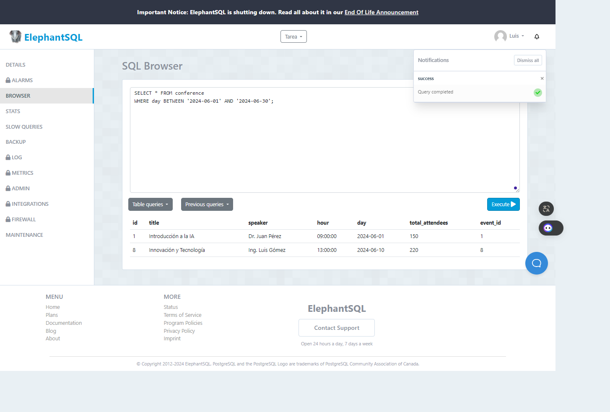
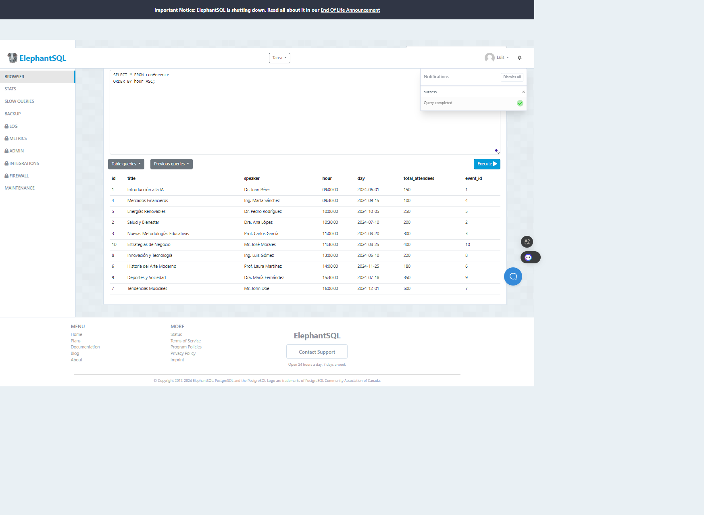

### Tarea TAS7 - Events

1. **¿Qué miembros asistieron a la conferencia?**
   ```sql
   SELECT * FROM register
   WHERE assisted = TRUE;


2. **Número total de asistentes es mayor a 300**
   ```sql
   SELECT * FROM event
   WHERE total_attendees > 300;


3. **Conferencias que ocurren en junio de 2024**
   ```sql
   SELECT * FROM conference
   WHERE day BETWEEN '2024-06-01' AND '2024-06-30';



4. **Ordenar alfabéticamente el nombre**
   ```sql
   SELECT * FROM member
   ORDER BY fullname ASC;


5. **Ordenará en orden ascendente las horas**
   ```sql
   SELECT * FROM conference
   ORDER BY hour ASC;

